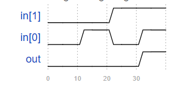
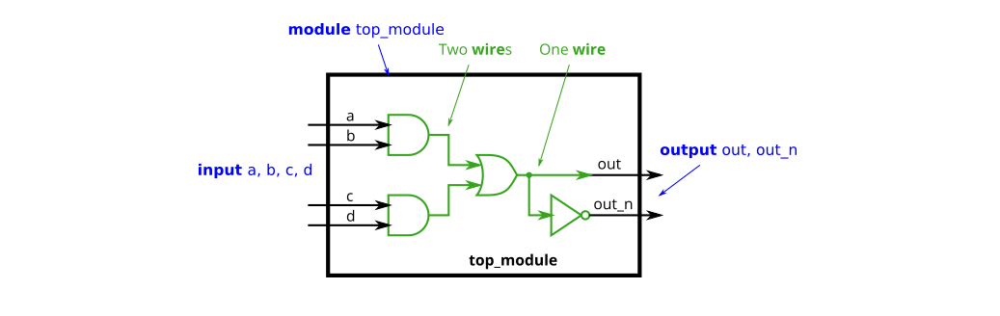
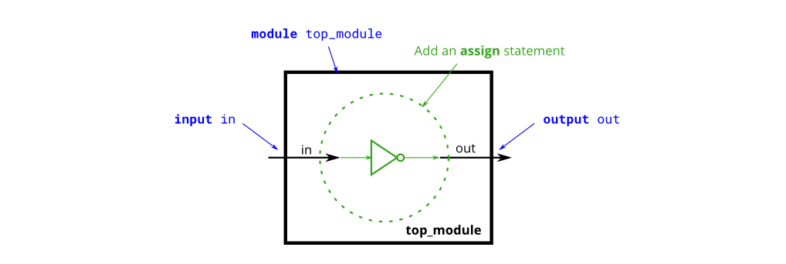
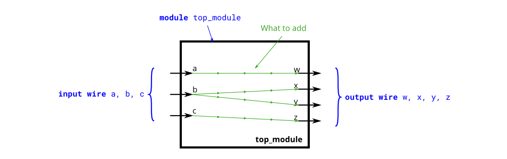
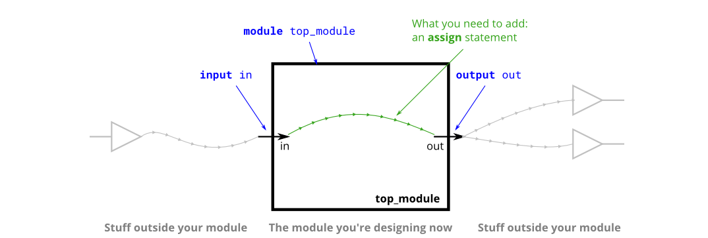
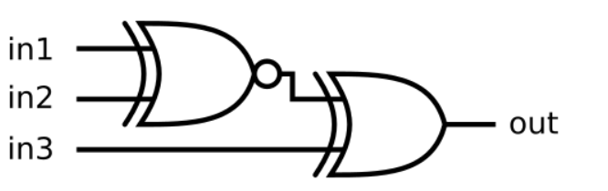
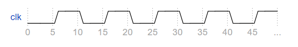
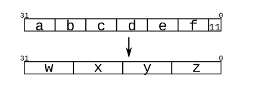
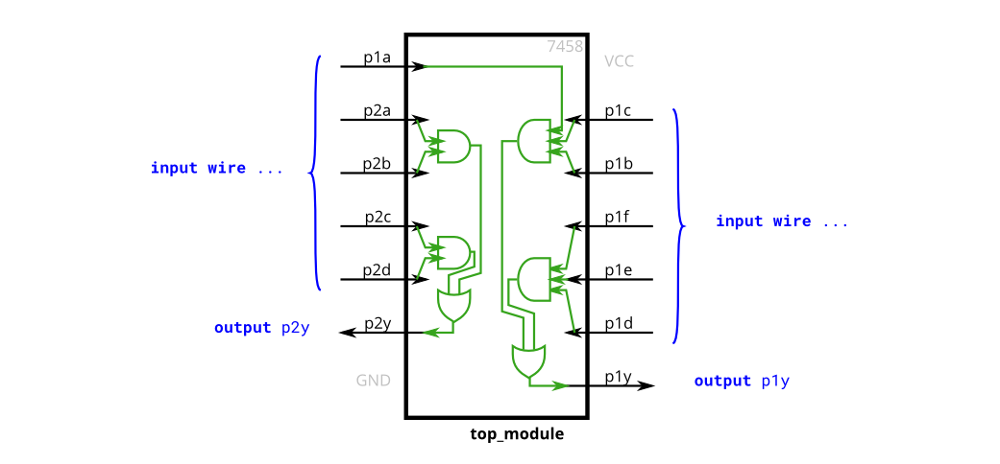

# 1. verilog基础

## 1.01 tb_与门

### 题目要求：
```
编写一个实例化AND门的testbench，并通过生成以下时序图来测试所有4个输入组合：
```



### 题目说明：
题目已提供以下要测试的AND门，端口如下，请直接使用：
```
module andgate (
	input [1:0] in,
	output out
);
```

请将下面testbench的代码补充完整：
```
module top_module();
	reg x,y;
	wire out; 
	andgate a({x,y},out);
endmodule
```

### 解
[1.01](./01/Main.v)


## 1.02 vector介绍

### 题目要求：

构建一个具有一个3位vector输入的电路,并将其拆分为三个单独的1位输出. 

### 题目说明：

vector用来对相关的信号进行分组,以便于操作.例如,wire [7:0] w;声明一个名为w的8位信号,在功能上相当于具有8条独立的线. 

至于为什么会是如下声明,主要是采用了小端序.
```
wire [99:0] my_vector；//声明一个宽度为100的信号
assign out=my_vector[10]；//从一组信号中选择一位
```


### 端口描述：
```
module top_module ( 
	input wire [2:0] vec,
	output wire [2:0] outv,
	output wire o2,
	output wire o1,
	output wire o0
);
```

### 解

[1.02](./02/Main.v)


## 1.03 声明wire

### 题目要求：

实现以下电路.创建两个wire以将and/or gate连接在一起.

### 题目说明：

到目前为止,电路都十分简单.随着电路变得越来越复杂,您将需要wire将内部组件连接在一起.当您需要使用导线时,您应该在模块体中在首次使用之前的某个地方声明它.(将来,您将遇到更多类型的信号和变量,它们也以相同的方式声明,但现在,我们将从Wire类型的信号开始).

请注意,Not gate 是输出,因此您不必在这里声明第三条线.wire可有多个输出,但只能有一个输入驱动. 

如果您遵循图中的电路结构,那么应该以四个赋值语句结束,因为有四个信号需要赋值. 



### 端口描述：
```
module top_module(
	input a,
	input b,
	input c,
	input d,
	output out,
	output out_n   
);
```

### 解

[1.03](./03/Main.v)


## 1.04 或非门

### 题目要求：

创建实现或非门的模块.或非门是一个输出反转的或门.

### 题目说明：

assign语句用一个值来驱动(drive)一条线(或者更正式地称为"net").这个值可以是任意复杂的函数,只要它是一个组合逻辑(即,无内存(memory-less),无隐藏状态).


### 端口描述：
```
module top_module( 
	input a,
	input b,
	output out
);
```

### 解

[1.04](./04/Main.v)


## 1.05 非门

### 题目要求：

创建实现非门的模块. 

### 题目说明：

这个电路和电线相似,但有点不同.当把电线从进线连接到出线时,我们要实现一个反相器(非门),而不是一根普通的线. 

使用assign语句.assign语句将连续地将in取反并输出. 



### 端口描述：
```
module top_module( 
	input in,
	output out
);
```

### 解

[1.05](./05/Main.v)


## 1.06 Four wires

### 题目要求：

创建一个具有3个输入和4个输出的模块,这些输入和输出的行为如图所示.

### 题目说明：

下图说明了电路的每个部分如何对应Verilog代码的每个部分.模块外部有三个输入端口和四个输出端口.

当您有多个assign语句时,它们在代码中的出现顺序并不重要.与编程语言不同,assign语句("连续赋值")描述事物之间的连接,而不是将值从一个事物复制到另一个事物的操作.

可能现在应该澄清的一个潜在的困惑来源是:这里的绿色箭头表示电线之间的连接,但不是wire本身.模块本身已经声明了7条线(名为A、B、C、W、X、Y和Z).这是因为input与output被声明为了wire类型.因此,assign语句不会创建wire,而是描述了在已存在的7条线之间创建的连接.



### 端口描述：
```
module top_module(
	input a,b,c,
	output w,x,y,z
);
```

### 解

[1.06](./06/Main.v)


## 1.07 wire类型

### 题目要求：

创建一个具有一个输入和一个输出的模块,其行为像一条"线"(wire).

### 题目说明：

与物理线不同但十分相似,Verilog中的线(和其他信号)是有方向的.这意味着信息只在一个方向上流动,从(通常是一个)源流向汇点(源通常也被称为驱动端,将值驱动到wire上).在verilog的"连续赋值"(assign)中,右侧的信号值被驱动到左侧的"线"上.请注意:赋值是"连续的",如果右侧的值发生更改,左侧的值将持续随之改变.(这里与其他语言有很大区别).连续赋值不是一次性事件,其赋值功能是永久持续的.

想要真正理解为啥会这样,你首先要明白,你并不是在编写程序,你其实是在用代码"画"电路! 因此输入端的电平高低的变化必然会影响到wire的另一端,你可以想像真的有一根电线连接两个变量.

模块(module)上的端口(port)也有方向(通常是输入 -- input或输出 -- output).输入端口由来自模块外部的信号驱动,而输出端口驱动外部的信号.从模块内部查看时,输入端口是驱动源,而输出端口是接收器.

下图说明了电路的每个部分如何对应Verilog代码的每个部分.模块和端口声明可以创建黑色盒子的电路.你的任务是通过添加一个assign语句来创建一条线(绿色).盒子外的部件不需你考虑,但你应该知道,将测试激励连接到top_module上的端口可以来测试黑色盒子电路.



### 端口描述：
```
module top_module( 
	input in,
	output out
);
```

### 解

[1.07](./07/Main.v)


## 1.08 两个门

### 题目要求：

实现如下电路



### 端口描述：
```
module top_module (
	input in1,
	input in2,
	input in3,
	output out
);
```

### 解

[1.08](./08/Main.v)


## 1.09 其他的门

### 题目要求：

实现如下电路:


### 端口描述：
```
module top_module (
	input in1,
	input in2,
	output out
);
```

### 解

[1.09](./09/Main.v)


## 1.10 输出0

### 题目要求：

建立一个没有输入，输出为常数0的电路。

### 端口描述：
```
module top_module (
	output zero
);
```

### 解

[1.10](./10/Main.v)


## 1.11 三目算符

### 题目要求：

给定四个无符号数,求其最小值.

### 题目说明：

verilog也有像C一样的三目算符: 

```
condition ? true : false;
```


### 端口描述：
```
module top_module (
	input [7:0] a, b, c, d,
	output [7:0] min
);
```

### 解

[1.11](./11/Main.v)


## 1.12 vector细节

### 题目要求：

建立一个电路,将输入的一个半字(16 bits,[15:0])分成高8位[15:8],与低8位[7:0]输出.

### 端口描述：
```
module top_module ( 
	input wire [15:0] in,
	output wire [7:0] out_hi,
	output wire [7:0] out_lo
);
```

### 解

[1.12](./12/Main.v)


## 1.13 vector片选

### 题目要求：

建立一个电路,使4字节字颠倒顺序.

### 题目说明：

32位vector可以被视为包含4个字节(位[31:24]、[23:16]等).建立一个电路,使4字节字颠倒顺序。即：
```
aaaaaaaabbbbbbbbccccccccdddddddd => ddddddddccccccccbbbbbbbbaaaaaaaa
```

### 端口描述：
```
module top_module (
	input [31:0] in,
	output [31:0] out
);
```

### 解

[1.13](.//13/Main.v)


## 1.14 位级操作

### 题目要求：

建立一个电路,该电路有两个3-bits输入,用于计算两个vector的"位或"(bitwise-OR)、"逻辑或"(Logical-OR)和"非"(NOT).将b的非放在out-not的高位部分(即[5:3]),将a的非放在低位部分.

看看模拟波形,看看bitwise-OR与Logical-OR的区别.


### 端口描述：
```
module top_module ( 
	input [2:0] a,
	input [2:0] b,
	output [2:0] out_or_bitwise,
	output out_or_logical,
	output [5:0] out_not
);
```

### 解

[1.14](./14/Main.v)


## 1.15 tb_时钟

### 题目要求：

编写一个testbench，创建一个电路模块dut的实例，并创建一个时钟信号来驱动该模块的clk输入。时钟周期为10 ps。要求在0时刻时钟被初始化为零，其第一次转换为0到1。



### 题目说明：

已提供dut模块，接口如下：

```
module dut(input clk);
```

**注意:文件开头应写明仿真时间单位为1ps**

请将下面testbench代码补充完整并提交：

```
module top_module();
    reg clk = 0;
    parameter CYCLE = 10;
    dut dut(clk);
endmodule
```

### 解

[1.15](./15/Main.v)


## 1.16 两位相等

### 题目要求：

若A==B则输出1,否则输出0

### 端口描述：
```
module top_module (
	input [1:0] A, 
	input [1:0] B, 
	output z 
); 
```

### 解

[1.16](./16/Main.v)


## 1.17 优化运算2

### 题目要求：

建立如下电路: 
- out_and: 对输入数据的所有位求与 
- out_or: 对输入数据所有位求或 
- out_xor:对输入数据所有位求异或 

### 端口描述：
```
module top_module ( 
	input [99:0] in,
	output out_and,
	output out_or,
	output out_xor 
);
```

### 解

[1.17](./17/Main.v)


## 1.18 优化运算1

### 题目要求：

计算输入8个位的异或.

### 题目说明：

奇偶校验经常被用来作为一种简单的方法检测错误.创建一个电路,该电路将为一个8位字节计算一个奇偶校验位.

### 端口描述：
```
module top_module (
	input [7:0] in,
	output parity
); 
```

### 解

[1.18](./18/Main.v)


## 1.19 按名称连接端口

### 题目要求：

实例化mod_a，按名称连接端口.

### 题目说明：

已有一个名为mod_a的模块,该模块具有2个输出和4个输入.必须按名称将6个端口连接到顶级模块的端口:

| Port in | mod_aPort in | top_module |
| :-: | :-: | :-: |
| output | out1 | out1 |
| output | out2 | out2 |
| input | in1 | a |
| input | in2 | b |
| input | in3 | c |
| input | in4 | d |

mod_a接口如下:
```
module mod_a ( output out1, output out2, input in1, input in2, input in3, input in4);
```

### 端口描述：
```
module top_module ( 
	input a, 
	input b, 
	input c,
	input d,
	output out1,
	output out2
);
```

### 解

[1.19](./19/Main.v)


## 1.20 按位置连接端口

### 题目要求：

实例化mod_a，按位置连接端口.

### 题目说明：

此问题与前一个问题(模块)类似.已有一个名为mod_a的模块,该模块端口按顺序具有2个输出和4个输入.您必须按位置将6个端口连接到顶级模块的端口out1、out2、A、B、C和D,顺序如下. 已有mod_a模块如下：

```
module mod_a ( output, output, input, input, input, input );
```

### 端口描述：
```
module top_module ( 
	input a, 
	input b, 
	input c,
	input d,
	output out1,
	output out2
);
```

### 解

[1.20](./20/Main.v)


## 1.21 模块

### 题目要求：

实例化mod_a.

### 题目说明：

现在你已经对module熟悉了,模块实际上就是封装起来的电路.下图显示了一个带有子模块的非常简单的电路.在本练习中,创建模块moda的一个实例,然后将模块的三个插脚(in1、in2和out)连接到顶级模块的三个端口(wire a、b和out).模块moda已经为您提供好,您需要实例化它.


你有两种实例化模块的方式:

1. 通过位置:
```
mod_a ins1 (wa, wb, wc);
```
2. 通过名称:
```
mod_a ins2 ( .out(wc), .in1(wa), .in2(wb) );
```

### 端口描述：
```
module top_module ( 
	input a, 
	input b, 
	output out 
);
```

### 解

[1.21](./21/Main.v)


## 1.22 vector反转

### 题目要求：

反转一个8位vector，即将输入的第i位输出到输出信号的第7-i位上.

### 端口描述：
```
module top_module (
	input [7:0] in,
	output [7:0] out
);
```

### 解

[1.22](./22/Main.v)


## 1.23 vector连接

### 题目要求：

连接并重新分割给定输入:



### 题目说明：

片选用于选择vector的部分.连接运算符{a,b,c}用于通过将vector的较小部分连接在一起来创建较大的vector.
```
{3'b111, 3'b000} => 6'b111000
{1'b1, 1'b0, 3'b101} => 5'b10101
{4'ha, 4'd10} => 8'b10101010     // 4'ha and 4'd10 are both 4'b1010 in binary
```

连接需要知道每个组件的宽度,因此,{1,2,3}是非法的,并导致错误消息："串联中不允许使用未经大小化的常量. 连接操作符可以在赋值的左侧和右侧使用."

```
input [15:0] in;
output [23:0] out;

// Swap two bytes. Right side and left side are both 16-bit vectors.
assign {out[7:0], out[15:8]} = in;         

// This is the same thing.
assign out[15:0] = {in[7:0], in[15:8]};    

// This is different. The 16-bit vector on the right is extended to
// match the 24-bit vector on the left, so out[23:16] are zero.
// In the first two examples, out[23:16] are not assigned.
assign out = {in[7:0], in[15:8]};       
```

### 端口描述：
```
module top_module (
	input [4:0] a, b, c, d, e, f,
	output [7:0] w, x, y, z
);
```

### 解

[1.23](./23/Main.v)


## 1.24 4位vector

### 题目要求：

建立一个具有4位输入的组合电路,输出要求如下:  
- out_and: 所有输入经过 "与门" 后的结果
- out_or : 所有输入经过 "或门" 后的结果
- out_xor: 所有输入经过 "异或门" 后的结果

### 端口描述：
```
module top_module ( 
	input [3:0] in,
	output out_and,
	output out_or,
	output out_xor
);
```

### 解

[1.24](./24/Main.v)


## 1.25 7458模块

### 题目要求：

实现如下电路: 



### 端口描述：
```
module top_module ( 
	input p1a, p1b, p1c, p1d, p1e, p1f,
	output p1y,
	input p2a, p2b, p2c, p2d,
	output p2y
);
```

### 解

[1.25](./25/Main.v)

