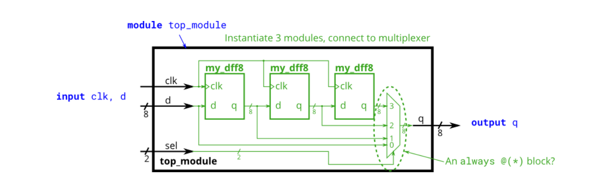
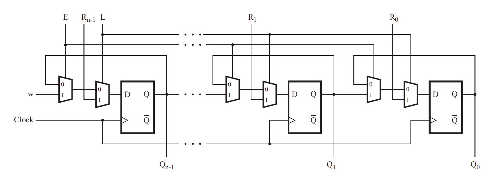

# 10. 时序逻辑电路设计4

## 10.01 模块与vector

### 题目要求：

我们为您提供了一个模块my_dff8,它有两个输入和一个输出(实现一组8位D-触发器).实例化三个my_dff8,然后将它们串联在一起,形成长度为3的8位宽移位寄存器.此外,创建一个4对1多路选择器,根据sel[1:0]选择输出内容.



### 端口描述：
```
module top_module ( 
    input clk, 
    input [7:0] d, 
    input [1:0] sel, 
    output [7:0] q 
);
```

### 解

[10.01](./01/Main.v)


## 10.02 带控制端的触发器组

### 题目要求：

创建一个16位D-触发器.

### 题目说明：

有时我们希望只修改触发器组的部分值.输入的字节控制信号byteena控制输入的16位寄存器的高低字节是否被写入.byteena[1]控制高字节d[15:8],而byteena[0]控制低字节d[7:0].

resetn是低电平有效的同步复位信号.

所有DFF由时钟的上升沿触发.

### 端口描述：
```
module top_module (
    input clk,
    input resetn,
    input [1:0] byteena,
    input [15:0] d,
    output [15:0] q
);
```

### 解

[10.02](./02/Main.v)


## 10.03 上升沿检测

### 题目要求：

对于一组输入信号的每一位,检测输入信号从某个时钟周期的0变为下个周期的1.(类似于上升沿检测).当对应位从0变为1后应当设置检测输出为1.

以下为波形样例,in为输入信号，pedge为检测输出信号，为了清楚起见,in[1]与pedge[1]被分别显示.


### 端口描述：
```
module top_module (
    input clk,
    input [7:0] in,
    output [7:0] pedge
);
```

### 解

[10.03](./03/Main.v)


## 10.04 多路选择器与触发器2

### 题目要求：

考虑如下n位移位寄存器电路:



请为这个电路实现一个子模块（包含一个D触发器与2个多路选择器）,命名为top_module,可供此电路调用.

### 端口描述：
```
module top_module (
    input clk,
    input w, R, E, L,
    output Q
);
```

### 解

[10.04](./04/Main.v)


## 10.05 算数左右移

### 题目要求

构建一个64位算术移位寄存器（shifter）,具有同步load数据功能.这个shifter根据amount信号选择,可左右移1位或8位.

在算术右移时,若符号位(q[63])为1则需要复制位,而并非简单的逻辑右移.

算术左移与逻辑左移没有区别.

- load: 寄存器载入数据(优先级最高)
- ena: 决定是否发生位移
- amount: 决定位移的方向
	- 2'b00: 算术左移1位
	- 2'b01: 算术左移8位
	- 2'b10: 算术右移1位
	- 2'b11: 算术右移8位
- q: shifter的内容

### 端口描述
```
module top_module(
    input clk,
    input load,
    input ena,
    input [1:0] amount,
    input [63:0] data,
    output reg [63:0] q
);
```

### 解

[10.05](./05/Main.v)

