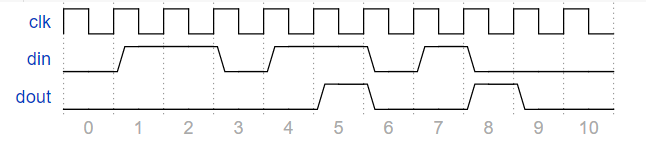
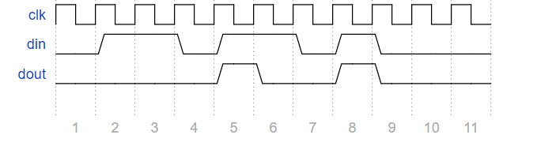

# 11. 时序逻辑电路设计5

## 11.01 验证1101序列（Moore）

### 题目要求：

用moore型状态机验证1101序列。

### 题目描述：

用使用状态机验证1101序列，注意：允许重复子序列。如图



### 端口描述：
```
module moore_1101(
	input clk,		//时钟信号
	input clr,		//reset复位信号，高电平有效
	input din,		//输入序列
	output dout		//输出结果
);
```

### 解

[11.01](./01/Main.v)


## 11.02 验证1101序列（Mealy）

### 题目要求：

用mealy型状态机验证1101序列

### 题目描述：

使用状态机验证1101序列，注意：允许重复子序列。



### 端口描述：
```
module mealy_1101(
    input clk,
    input clr,
    input din,
    output dout
);
```

### 信号说明：
- clk 为时钟信号
- clr 为reset信号，高电平有效，异步复位
- din 为输入序列
- dout 为结果输出

### 解

[11.02](./02/Main.v)

