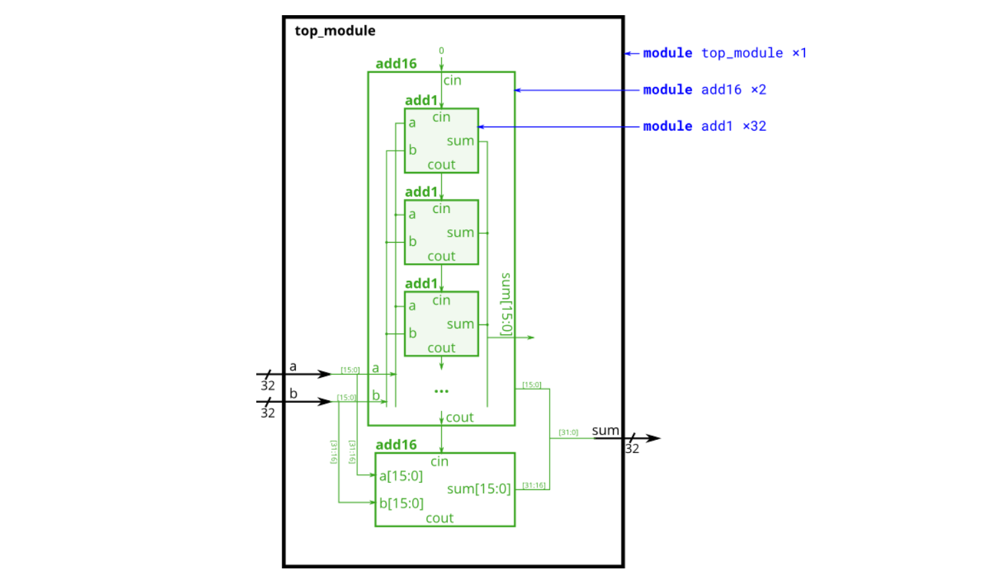
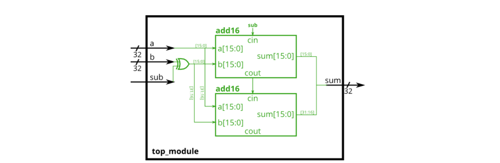
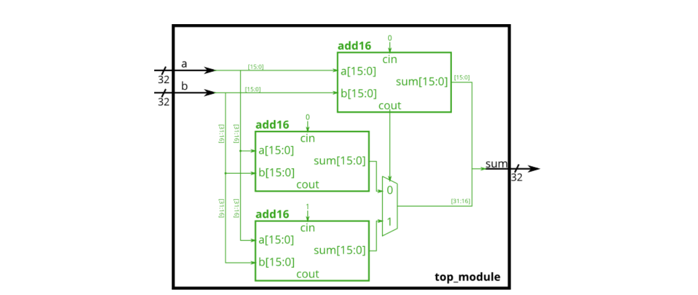

# 12. 数字部件设计1

## 12.01 全加器

### 题目要求：

创建一个一位全加器,对两个1位加数（a、b）和进位输入cin做加法,输出本位sum和与进位cout

### 端口描述：
```
module top_module( 
	input a, b, cin,
	output cout, sum 
);
```

### 解

[12.01](./01/Main.v)


## 12.02 半加器

### 题目要求：

创建一个1位的半加器,对两个1位输入做加法，输出本位和sum与进位cout. 

### 端口描述：
```
module top_module( 
	input a, b,
	output cout, sum
);
```

### 解

[12.02](./02/Main.v)


## 12.03 4位加法器

不知从何时起，北航计算机学院15级学生高小明同学迷上了计算机硬件的研究。最近他正在探索加法器的设计，在理解了一位加法器的原理之后，他尝试着用Verilog HDL设计四位加法器.......

### 提交要求

使用Verilog搭建一个四位加法器并提交。

### #具体模块端口定义如下：

| 信号名 | 方向 | 描述 |
| :-: | :-: | :-: |
| A[3:0] | I | 第一个加数 |
| B[3:0] | I | 第二个加数 |
| Clk | I | 时钟信号 |
| En | I | 更新信号 |
| Sum[3:0] | O | 两数相加之和 |
| Overflow | O | 溢出标志位 |

### #模块功能定义如下：

| 序号 | 功能名称 | 功能描述 |
| :-: | :-: | :-: |
| 1 | 加运算 | A和B进行无符号加运算，当需要更新时将结果赋值给Sum，溢出赋值给Overflow |

### #注：本题与视频的区别在于视频中是在需要时更新输入，本题要求更新输出。
- 输入：  A（4bit）、B（4bit）、Clk（1bit）、En（1bit）
- 输出：  Sum(4bit)、 Overflow（1bit）
- 在时钟信号上升沿且En为1时更新Sum和Overflow，初始的输出设置为0
- 加法器做的是无符号运算
- 测试保证时钟上升沿到来时前后短时间内输入值保持恒定不变
- 文件内模块名:     adder

### 首次提交TIPS

提交Verilog程序时一定要注意模块名还有端口名称需与题目要求一致。例如，此题的要求是文件内模块名为adder，端口名称在表格中已给出，也就是说我们需要保证端口信息是这样的（顺序无所谓）：


如果端口信息出现错误，评测机就会返回compile error的信息。所以在之后的提交中，大家请务必关注端口设置的问题。

### 解

[12.03](./03/Main.v)


## 12.04 加法器2

### 题目要求：

请实现一个名为add1的一位全加器模块,用于构建16位加法器add16（add16模块已经存在）,并用add16实现一个32位加法器.



### 题目说明：

提供的模块add16具有以下声明：

module add16 ( input[15:0] a, input[15:0] b, input cin, output[15:0] sum, output cout );

注意，你需要提交的源程序文件中需包含top_module和add1两个模块的代码.

### 端口描述：
```
module top_module(
	input [31:0] a,
	input [31:0] b,
	output [31:0] sum
);
```
```
module add1 ( 
	input a, 
	input b, 
	input cin,   
	output sum, 
	output cout 
);
```

### 解

[12.04](./04/Main.v)


## 12.05 加法器1

### 题目要求：

为你提供了add16模块,这是一个16位加法器,请实例化两个该模块并实现如下图32位加法器,请考虑进位.


### 题目说明：

提供的模块add16具有以下声明：
```
module add16 ( 
	input [15:0] a, 
	input [15:0] b, 
	input cin, 
	output [15:0] sum, 
	output cout
);
```

### 端口描述：
```
module top_module(
	input [31:0] a,
	input [31:0] b,
	output [31:0] sum
);
```

### 解

[12.05](./05/Main.v)

## 12.06 加减法器

### 题目要求：

已为你提供了16位加法器add16模块,请实现下图所示的32位加-减法器,通过一个32位"异或门"来决定加法或减法. 



### 题目说明：

其中add16的端口描述为
```
module add16 (
	input [15:0] a, b,
	input cin, 
	output [15:0] sum, 
	output cout
);
```

### 端口描述：
```
module top_module(
	input [31:0] a,
	input [31:0] b,
	input sub,
	output [31:0] result
);
```

### 解

[12.06](./06/Main.v)


## 12.07 adder练习

### 题目要求：

实现如下图所示电路:


### 端口描述：
```
module top_module (
	input [3:0] x,
	input [3:0] y, 
	output [4:0] sum
);
```

### 解

[12.07](./07/Main.v)


## 12.08 进位选择加法器

### 题目要求：

已为您提供了16位加法器add16模块,请实现下图中黑框电路模块,需考虑低16位向高16位的进位. 



### 题目说明：

其中add16的端口描述为
```
module add16(
	input [15:0] a, b,
	input cin, 
	output [15:0] sum, 
	output cout
);
```

### 端口描述：
```
module top_module(
	input [31:0] a,
	input [31:0] b,
	output [31:0] sum
);
```

### 解

[12.08](./08/Main.v)


## 12.09 32位逐位进位加法器

### 题目要求：

使用逐位进位的方法构建一个32位的加法器。

### 题目说明：

你在构建8位加法器时实例化了8个一位全加器，但构建32位加法器时直接实例化一位全加器显然不太方便……

你可以尝试先使用1位加法器构建2位加法器，再用2位加法器构建4位加法器，……以此类推，完成32位加法器的构建。

注：后台会对提交代码进行抽查，发现未使用逐位进位构建电路将直接得0分。

### 端口描述：
```
module rcadd32(
	input [31:0]a,
	input [31:0]b,
	input cin,
	output [31:0]sum,
	output cout
);
```

### 解

[12.09](./09/Main.v)


## 12.10 32位选择进位加法器

### 题目要求：

使用**选择进位**的方法构建一个32位的加法器。

### 题目说明：

你的逐位进位加法器每一级都要等待上一级加法器的进位结果cout产生后才能进行计算，总共32位间的进位延迟在实际电路中是很严重的，所以我们需要改进这个加法器。

由于加法器的进位输入cin只有0和1两种可能，选择进位加法器提前进行两次加法运算，在进位输入cin到达时只需对结果进行选通，提高了加法器的运行效率。

**注：后台会对提交代码进行抽查，发现未使用选择进位构建电路将直接得0分。**

### 端口描述：
```
module csadd32 (
    input [31:0]a,
    input [31:0]b,
    input cin,
    output [31:0]sum,
    output cout
);
```

### 解

[12.10](./10/Main.v)


## 12.11 32位超前进位加法器

### 题目要求：

使用**超前进位**的方法构建一个32位的加法器。

### 题目说明：

通过计算进位产生和进位传播信号，展开加法的逻辑递归式，可以从输入直接计算出某一位的输出值，减少加法器间的传递时间，提高加法器的运行速度。

**注：后台会对提交代码进行抽查，发现未使用超前进位构建电路将直接得0分。**

### 端口描述：
```
module claadd32(
    input [31:0] a,
    input [31:0] b,
    input cin,
    output [31:0] sum,
    output cout
);
```

### 解

[12.11](./11/Main.v)


## 12.12 溢出检测

### 题目要求：

假设您有两个8位的补码, A[7:0] 和 B[7:0]. 这些数字加在一起产生 s[7:0]. 还要输出是否发生(有符号的)溢出overflow（1为有溢出）.

### 端口描述：
```
module top_module (
	input [7:0] a,
	input [7:0] b,
	output [7:0] s,
	output overflow
);
```

### 解

[12.12](./Main.v)

