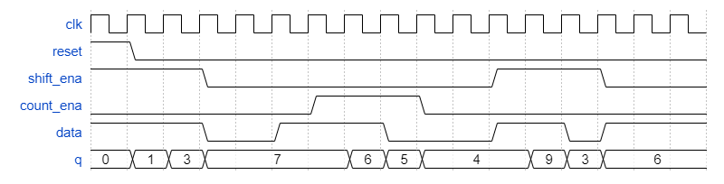
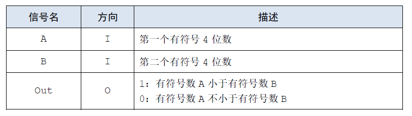
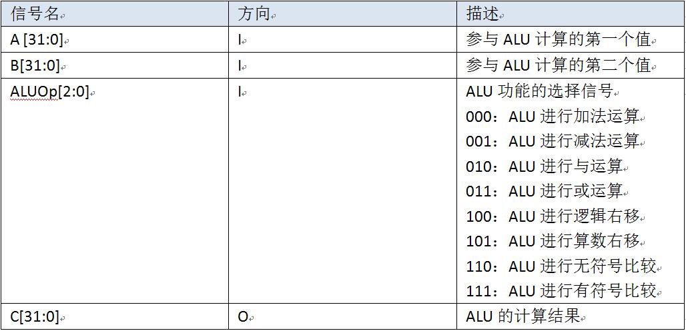

# 13. 数字部件设计2

## 13.01 8位乘法器

### 题目要求

请完成8位乘法器的设计与仿真验证

### 端口描述

顶层模块声明：

```
module mult8(
    input[7:0]a,
    input[7:0]b,
    output [15:0]p
);
```

提示：实在不会可以去课本上找找基本原理，课本上有较难的乘法器实现方法！

| 信号名称 | 信号作用 |
| :-: | :-: |
| a[7:0] | 第一个输入信号 |
| b[7:0] | 第二个输入信号 |
| p[15:0] | 输出信号 |

### 解

[13.01](./01/Main.v)


## 13.02 四位二进制计数器

### 题目要求

构建一个0-15的四位二进制计数器,reset是高电平有效的同步复位,将计数器输出复位为0。


### 端口描述
```
module top_module (
    input clk,
    input reset,      // Synchronous active-high reset
    output [3:0] q
);
```

### 解

[13.02](./02/Main.v)


## 13.03 十进制计数器0

### 题目要求

建立一个十进制数计数器,reset是高电平有效的同步复位,将计数器输出复位为0. 


### 端口描述
```
module top_module (
    input clk,
    input reset,        // Synchronous active-high reset
    output [3:0] q
);
```

### 解

[13.03](./03/Main.v)


## 13.04 counter1-12

### 题目要求

设计一个具有以下输入输出的Counter:

- 1-12循环计数

- 高电平有效同步复位信号reset，将计数器输出重置为1；

- 当enable为高电平时Counter进行计数工作

- 时钟信号上升沿触发

- Q[3:0] 为counter的输出

### 端口描述
```
module top_module (
    input clk,
    input reset,
    input enable,
    output [3:0] Q
);
```

### 解

[13.04](./04/Main.v)


## 13.05 四位移位寄存器和递减计数器

### 题目要求
构建一个时序电路，实现四位移位寄存器，也可用作递减计数器。

### 题目说明
reset为高电平有效的同步复位信号，将输出q复位为0；

当shift_ena为1时，输入数据data成为输出q的最低位，同时q从低位向高位移位，详见时序图；

当count_ena为1时，移位寄存器q中当前的数字递减计数，详见时序图。

假设不会同时使用shift_ena和count_ena，因此你不需要考虑哪种情况优先级最高。 



### 端口描述
```
module top_module (
    input clk,
    input reset,
    input shift_ena,
    input count_ena,
    input data,
    output [3:0] q
);
```

### 解

[13.05](./05/Main.v)


## 13.06 4位比较器

### 提交要求
使用Verilog搭建一个四位有符号比较器并提交。具体模块端口定义如下：



- 必须严格按照模块的端口定义
- 文件内模块名:     comparator
- 注意是小于！
- 输入的A和B为四位数，不是五位数，且为补码的形式输入，最高位（符号位）+其余三位构成一个输入
- **写代码时不能直接用>或者<(为了避免误判，非阻塞赋值符号"<="也敬请避免使用。)**

### 解

[13.06](./06/Main.v)


## 13.07 32位六运算ALU (题目有错，不考)

### 提交要求

#### 简介
使用Verilog搭建一个32位六运算ALU并提交。具体模块端口定义如下：



模块功能定义如下：


#### 要求：
- 必须严格按照模块的端口定义
- 文件内模块名:alu

### 解

[13.07](./07/Main.v)

