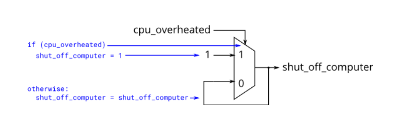

# 2. 组合逻辑电路设计1

## 2.01 简单电路A

### 题目要求：

实现一个模块,具有 z=(x^y)&x 功能.

### 端口描述：
```
module top_module (
	input x, 
	input y, 
	output z
);
```

### 解

[2.01](./01/Main.v)


## 2.02 简单电路B

### 题目要求：

电路B可以通过以下模拟波形来描述：


### 端口描述：
```
module top_module (
	input x, 
	input y, 
	output z
);
```

### 解

[2.02](./02/Main.v)


## 2.03 always-组合逻辑

### 题目要求：

使用两种赋值方式实现两个信号a、b的与.


### 题目说明：

数字电路是由电线将逻辑门相连组成的，所以任何电路理论上都可以表示为模块和赋值语句的某种组合。但有时这不是描述电路最方便的方法。

以下两种always block是十分常用和重要的：
```
组合逻辑: always @(*)
时序逻辑: always @(posedge clk)
```

always @(*)就相当于赋值语句--assign，因此选择哪一种语法仅仅取决与方便程度。block内还提供更丰富的语句集，比如if-else，case等等。但不能包含连续赋值（即不可包含assign）。

以下语句是等价的：
```
assign out1 = a & b | c ^ d;
always @(*) out2 = a & b | c ^ d;
```

使用两种方法完成a&b，验证上述两个语句是等价的。

### 端口描述：
```
module top_module(
	input a, 
	input b,
	output wire out_assign,
	output reg out_alwaysblock
);
```

### 解

[2.03](./03/Main.v)


## 2.04 if语句

### 题目要求：

        建立一个在a和b之间选择的2选1多路选择器模块.如果selb1和selb2都为真,则选择b.否则,选择a.执行相同的操作两次,一次使用assign语句,一次使用if语句. 


### 题目说明：

if语句通常可用于描述一个2选1的多路选择器,如果条件为真,则选择一个输出,如果条件为假,则选择另一个输出.以下两种写法是等价的:

```
always @(*) begin
	if (condition) begin
		out = x;
	end

	else begin
		out = y;
	end
end
```

```
assign out = (condition) ? x : y;
```

### 端口描述：
```
module top_module(
	input a,
	input b,
	input sel_b1,
	input sel_b2,
	output wire out_assign,
	output reg out_always
);
```

### 解

[2.04](./04/Main.v)


## 2.05 if语句引发锁存

### 题目要求：

下面为您提供的代码中包含锁存的错误行为.请修正这些错误,完成两个逻辑：只有在电脑过热的时候才会关掉它;到达目的地或者需要加油的话就停止驾驶.



### 题目说明：

语法正确的代码不一定能产生合理的电路（组合逻辑+触发器）。通常遇到的问题是："除了你指定的情况以外，会发生什么？"。Verilog的答案是：保持输出不变。

"保持输出不变"的这种行为意味着需要记住当前状态，从而产生锁存器。而组合逻辑不能记住任何状态。组合电路必须在所有条件下分配输出值。

### 电路的代码描述：
```
module top_module (
	input      cpu_overheated,
	output reg shut_off_computer,
	input      arrived,
	input      gas_tank_empty,
	output reg keep_driving
); 
	always @(*) begin
		if (cpu_overheated)
			shut_off_computer = 1;
	end

	always @(*) begin
		if (~arrived)
			keep_driving = ~gas_tank_empty;
	end

endmodule
```

### 解

[2.05](./05/Main.v)


## 2.06 case语句

### 题目要求：

创建一个6选1的多路选择器.当sel取值在0到5之间时,选择相应的数据输入,否则,输出0.数据输入和输出均为4位宽.

### 题目说明：

verilog中的case语句功能上等同于if elseif else的序列.
```
always @(*) begin     // This is a combinational circuit
	case (in)
		1'b1: begin 
			out = 1'b1;  // begin-end if >1 statement
		end

		1'b0: out = 1'b0;
		default: out = 1'bx;
	endcase
end
```
如果有大量选项的情况,case语句比if语句更方便.

### 端口描述：
```
module top_module ( 
	input [2:0] sel,
	input [3:0] data0,
	input [3:0] data1,
	input [3:0] data2,
	input [3:0] data3,
	input [3:0] data4,
	input [3:0] data5,
	output reg [3:0] out
);
```

### 解

[2.06](./06/Main.v)


