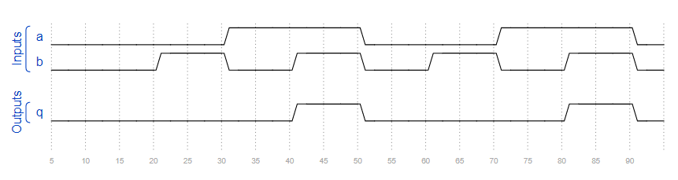

# 4. 组合逻辑电路设计3

## 4.01 组合电路1

### 题目要求：

请设计一个组合逻辑电路。满足下面仿真波形所描述的电路功能。



### 端口描述：
```
module top_module (
	input a,
	input b,
	output q
);
```

### 解

[4.01](./01/Main.v)


## 4.02 组合电路2

### 题目要求：

这是一个组合电路。读取仿真波形以确定电路的功能，然后实现它。（提示：注意观察输入信号1的个数）


### 端口描述：
```
module top_module (
	input a,
	input b,
	input c,
	input d,
	output q
);
```

### 解

[4.02](./02/Main.v)


## 4.03 组合电路3

### 题目要求：

这是一个组合电路。读取仿真波形以确定电路的功能，然后实现它。


### 端口描述：
```
module top_module (
	input a,
	input b,
	input c,
	input d,
	output q
);
```

### 解

[4.03](./03/Main.v)


## 4.04 组合电路4

### 题目要求：

这是一个组合电路。读取仿真波形以确定电路的功能，然后实现它。


### 端口描述：
```
module top_module (
	input a,
	input b,
	input c,
	input d,
	output q
);
```

### 解

[4.04](./04/Main.v)

