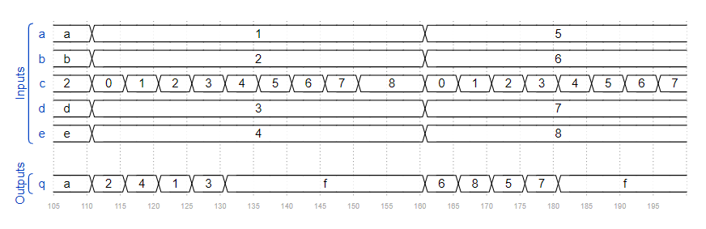
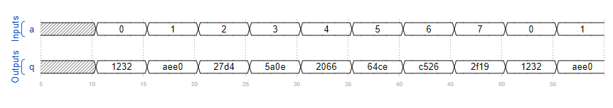

# 5. 组合逻辑电路设计4

## 5.01 组合电路5

### 题目要求：

这是一个组合电路。读取仿真波形以确定电路的功能，然后实现它。




### 端口描述：
```
module top_module (
	input [3:0] a,
	input [3:0] b,
	input [3:0] c,
	input [3:0] d,
	input [3:0] e,
	output [3:0] q
);
```

### 解

[5.01](./01/Main.v)


## 5.02 组合电路6

### 题目要求：

这是一个组合电路。读取仿真波形以确定电路的功能，然后实现它。



### 端口描述：
```
module top_module (
	input [2:0] a,
	output [15:0] q
); 
```

### 解

[5.02](./02/Main.v)

