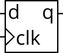

# 7. 时序逻辑电路设计1

## 7.01 D触发器

### 题目要求：

创建一个D-触发器.

### 题目说明：

D-触发器可以存储一个bit数据并根据时钟信号周期的更新数据,一般是由正边沿触发.

D-触发器由"Always block"创建.

D-触发器是"组合逻辑之后连接触发器"的最简单常用的形式.



### 端口描述：
```
module top_module (
    input clk,
    input d,
    output q
);
```

### 解

[7.01](./01/Main.v)


## 7.02 D触发器组合

### 题目要求：

创建8个D触发器,所有的D触发器均由时钟上升沿触发.

### 端口描述：
```
module top_module (
    input clk,
    input [7:0] d,
    output [7:0] q
);
```

### 解

[7.02](./02/Main.v)


## 7.03 D锁存器

### 题目要求：

实现一个高通低锁的D锁存器，如下电路:


### 题目说明：

这是一个锁存器,因此EDA工具可能会报锁存警告。

锁存器是电平敏感的电路单元，需注意always块的敏感表写法.

### 端口描述：
```
module top_module (
    input d, 
    input ena,
    output q
);
```

### 解

[7.03](./03/Main.v)


## 7.04 门控触发器

### 题目要求：

实现如下电路:


### 端口描述：
```
module top_module (
    input clk,
    input in, 
    output out
);
```

### 解

[7.04](./04/Main.v)

