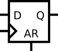

# 8. 时序逻辑电路设计2

## 8.01 同步复位触发器

### 题目要求：

实现如下电路（R为同步复位信号）:


### 端口描述：
```
module top_module (
    input clk,
    input d, 
    input r,   // synchronous reset
    output q
);
```

### 解

[8.01](./01/Main.v)


## 8.02 异步复位触发器

### 题目要求：

请实现如下电路（AR为异步复位信号，AR上升沿q清零）。



### 端口描述：
```
module top_module (
    input clk,
    input d, 
    input ar,   // asynchronous reset
    output q
);
```

### 解

[8.02](./02/Main.v)


## 8.03 同步复位触发器组

### 题目要求：

创建1个8位的同步复位D-触发器，复位信号(Reset)高电平有效.触发器在时钟上升沿信号触发.

### 端口描述：
```
module top_module (
    input clk,
    input reset,            // Synchronous reset
    input [7:0] d,
    output [7:0] q
);
```

### 解

[8.03](./03/Main.v)


## 8.04 可异步复位的触发器组

### 题目要求：

使用高电平有效异步复位信号(areset)创建1个8位DFF.所有DFF由时钟上升沿触发.

### 端口描述：
```
module top_module (
    input clk,
    input areset,   // active high asynchronous reset
    input [7:0] d,
    output [7:0] q
);
```

### 解

[8.04](./04/Main.v)

