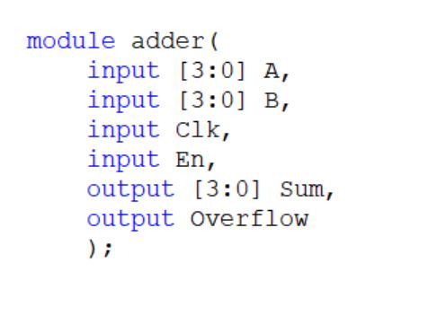

# Verilog Homework

## 1. verilog基础

### 1.01 tb_与门

#### 题目要求：
```
编写一个实例化AND门的testbench，并通过生成以下时序图来测试所有4个输入组合：
```


#### 题目说明：
题目已提供以下要测试的AND门，端口如下，请直接使用：
```
module andgate (
	input [1:0] in,
	output out
);
```

请将下面testbench的代码补充完整：
```
module top_module();
	reg x,y;
	wire out; 
	andgate a({x,y},out);
endmodule
```

#### 解
[1.01](./1/01/Main.v)


### 1.02 vector介绍

#### 题目要求：

构建一个具有一个3位vector输入的电路,并将其拆分为三个单独的1位输出. 

#### 题目说明：

vector用来对相关的信号进行分组,以便于操作.例如,wire [7:0] w;声明一个名为w的8位信号,在功能上相当于具有8条独立的线. 

至于为什么会是如下声明,主要是采用了小端序.
```
wire [99:0] my_vector；//声明一个宽度为100的信号
assign out=my_vector[10]；//从一组信号中选择一位
```


#### 端口描述：
```
module top_module ( 
	input wire [2:0] vec,
	output wire [2:0] outv,
	output wire o2,
	output wire o1,
	output wire o0
);
```

#### 解

[1.02](./1/02/Main.v)


### 1.03 声明wire

#### 题目要求：

实现以下电路.创建两个wire以将and/or gate连接在一起.

#### 题目说明：

到目前为止,电路都十分简单.随着电路变得越来越复杂,您将需要wire将内部组件连接在一起.当您需要使用导线时,您应该在模块体中在首次使用之前的某个地方声明它.(将来,您将遇到更多类型的信号和变量,它们也以相同的方式声明,但现在,我们将从Wire类型的信号开始).

请注意,Not gate 是输出,因此您不必在这里声明第三条线.wire可有多个输出,但只能有一个输入驱动. 

如果您遵循图中的电路结构,那么应该以四个赋值语句结束,因为有四个信号需要赋值. 


#### 端口描述：
```
module top_module(
	input a,
	input b,
	input c,
	input d,
	output out,
	output out_n   
);
```

#### 解

[1.03](./1/03/Main.v)


### 1.04 或非门

#### 题目要求：

创建实现或非门的模块.或非门是一个输出反转的或门.

#### 题目说明：

assign语句用一个值来驱动(drive)一条线(或者更正式地称为"net").这个值可以是任意复杂的函数,只要它是一个组合逻辑(即,无内存(memory-less),无隐藏状态).


#### 端口描述：
```
module top_module( 
	input a,
	input b,
	output out
);
```

#### 解

[1.04](./1/04/Main.v)


### 1.05 非门

#### 题目要求：

创建实现非门的模块. 

#### 题目说明：

这个电路和电线相似,但有点不同.当把电线从进线连接到出线时,我们要实现一个反相器(非门),而不是一根普通的线. 

使用assign语句.assign语句将连续地将in取反并输出. 


#### 端口描述：
```
module top_module( 
	input in,
	output out
);
```

#### 解

[1.05](./1/05/Main.v)


### 1.06 Four wires

#### 题目要求：

创建一个具有3个输入和4个输出的模块,这些输入和输出的行为如图所示.

#### 题目说明：

下图说明了电路的每个部分如何对应Verilog代码的每个部分.模块外部有三个输入端口和四个输出端口.

当您有多个assign语句时,它们在代码中的出现顺序并不重要.与编程语言不同,assign语句("连续赋值")描述事物之间的连接,而不是将值从一个事物复制到另一个事物的操作.

可能现在应该澄清的一个潜在的困惑来源是:这里的绿色箭头表示电线之间的连接,但不是wire本身.模块本身已经声明了7条线(名为A、B、C、W、X、Y和Z).这是因为input与output被声明为了wire类型.因此,assign语句不会创建wire,而是描述了在已存在的7条线之间创建的连接.


#### 端口描述：
```
module top_module(
	input a,b,c,
	output w,x,y,z
);
```

#### 解

[1.06](./1/06/Main.v)


### 1.07 wire类型

#### 题目要求：

创建一个具有一个输入和一个输出的模块,其行为像一条"线"(wire).

#### 题目说明：

与物理线不同但十分相似,Verilog中的线(和其他信号)是有方向的.这意味着信息只在一个方向上流动,从(通常是一个)源流向汇点(源通常也被称为驱动端,将值驱动到wire上).在verilog的"连续赋值"(assign)中,右侧的信号值被驱动到左侧的"线"上.请注意:赋值是"连续的",如果右侧的值发生更改,左侧的值将持续随之改变.(这里与其他语言有很大区别).连续赋值不是一次性事件,其赋值功能是永久持续的.

想要真正理解为啥会这样,你首先要明白,你并不是在编写程序,你其实是在用代码"画"电路! 因此输入端的电平高低的变化必然会影响到wire的另一端,你可以想像真的有一根电线连接两个变量.

模块(module)上的端口(port)也有方向(通常是输入 -- input或输出 -- output).输入端口由来自模块外部的信号驱动,而输出端口驱动外部的信号.从模块内部查看时,输入端口是驱动源,而输出端口是接收器.

下图说明了电路的每个部分如何对应Verilog代码的每个部分.模块和端口声明可以创建黑色盒子的电路.你的任务是通过添加一个assign语句来创建一条线(绿色).盒子外的部件不需你考虑,但你应该知道,将测试激励连接到top_module上的端口可以来测试黑色盒子电路.


#### 端口描述：
```
module top_module( 
	input in,
	output out
);
```

#### 解

[1.07](./1/07/Main.v)


### 1.08 两个门

#### 题目要求：

实现如下电路


#### 端口描述：
```
module top_module (
	input in1,
	input in2,
	input in3,
	output out
);
```

#### 解

[1.08](./1/08/Main.v)


### 1.09 其他的门

#### 题目要求：

实现如下电路:


#### 端口描述：
```
module top_module (
	input in1,
	input in2,
	output out
);
```

#### 解

[1.09](./1/09/Main.v)


### 1.10 输出0

#### 题目要求：

建立一个没有输入，输出为常数0的电路。

#### 端口描述：
```
module top_module (
	output zero
);
```

#### 解

[1.10](./1/10/Main.v)


### 1.11 三目算符

#### 题目要求：

给定四个无符号数,求其最小值.

#### 题目说明：

verilog也有像C一样的三目算符: 

```
condition ? true : false;
```


#### 端口描述：
```
module top_module (
	input [7:0] a, b, c, d,
	output [7:0] min
);
```

#### 解

[1.11](./1/11/Main.v)


### 1.12 vector细节

#### 题目要求：

建立一个电路,将输入的一个半字(16 bits,[15:0])分成高8位[15:8],与低8位[7:0]输出.

#### 端口描述：
```
module top_module ( 
	input wire [15:0] in,
	output wire [7:0] out_hi,
	output wire [7:0] out_lo
);
```

#### 解

[1.12](./1/12/Main.v)


### 1.13 vector片选

#### 题目要求：

建立一个电路,使4字节字颠倒顺序.

#### 题目说明：

32位vector可以被视为包含4个字节(位[31:24]、[23:16]等).建立一个电路,使4字节字颠倒顺序。即：
```
aaaaaaaabbbbbbbbccccccccdddddddd => ddddddddccccccccbbbbbbbbaaaaaaaa
```

#### 端口描述：
```
module top_module (
	input [31:0] in,
	output [31:0] out
);
```

#### 解

[1.13](./1//13/Main.v)


### 1.14 位级操作

#### 题目要求：

建立一个电路,该电路有两个3-bits输入,用于计算两个vector的"位或"(bitwise-OR)、"逻辑或"(Logical-OR)和"非"(NOT).将b的非放在out-not的高位部分(即[5:3]),将a的非放在低位部分.

看看模拟波形,看看bitwise-OR与Logical-OR的区别.


#### 端口描述：
```
module top_module ( 
	input [2:0] a,
	input [2:0] b,
	output [2:0] out_or_bitwise,
	output out_or_logical,
	output [5:0] out_not
);
```

#### 解

[1.14](./1/14/Main.v)


### 1.15 tb_时钟

#### 题目要求：

编写一个testbench，创建一个电路模块dut的实例，并创建一个时钟信号来驱动该模块的clk输入。时钟周期为10 ps。要求在0时刻时钟被初始化为零，其第一次转换为0到1。


#### 题目说明：

已提供dut模块，接口如下：

```
module dut(input clk);
```

**注意:文件开头应写明仿真时间单位为1ps**

请将下面testbench代码补充完整并提交：

```
module top_module();
    reg clk = 0;
    parameter CYCLE = 10;
    dut dut(clk);
endmodule
```

#### 解

[1.15](./1/15/Main.v)


### 1.16 两位相等

#### 题目要求：

若A==B则输出1,否则输出0

#### 端口描述：
```
module top_module (
	input [1:0] A, 
	input [1:0] B, 
	output z 
); 
```

#### 解

[1.16](./1/16/Main.v)


### 1.17 优化运算2

#### 题目要求：

建立如下电路: 
- out_and: 对输入数据的所有位求与 
- out_or: 对输入数据所有位求或 
- out_xor:对输入数据所有位求异或 

#### 端口描述：
```
module top_module ( 
	input [99:0] in,
	output out_and,
	output out_or,
	output out_xor 
);
```

#### 解

[1.17](./1/17/Main.v)


### 1.18 优化运算1

#### 题目要求：

计算输入8个位的异或.

#### 题目说明：

奇偶校验经常被用来作为一种简单的方法检测错误.创建一个电路,该电路将为一个8位字节计算一个奇偶校验位.

#### 端口描述：
```
module top_module (
	input [7:0] in,
	output parity
); 
```

#### 解

[1.18](./1/18/Main.v)


### 1.19 按名称连接端口

#### 题目要求：

实例化mod_a，按名称连接端口.

#### 题目说明：

已有一个名为mod_a的模块,该模块具有2个输出和4个输入.必须按名称将6个端口连接到顶级模块的端口:

| Port in | mod_aPort in | top_module |
| :-: | :-: | :-: |
| output | out1 | out1 |
| output | out2 | out2 |
| input | in1 | a |
| input | in2 | b |
| input | in3 | c |
| input | in4 | d |

mod_a接口如下:
```
module mod_a ( output out1, output out2, input in1, input in2, input in3, input in4);
```

#### 端口描述：
```
module top_module ( 
	input a, 
	input b, 
	input c,
	input d,
	output out1,
	output out2
);
```

#### 解

[1.19](./1/19/Main.v)


### 1.20 按位置连接端口

#### 题目要求：

实例化mod_a，按位置连接端口.

#### 题目说明：

此问题与前一个问题(模块)类似.已有一个名为mod_a的模块,该模块端口按顺序具有2个输出和4个输入.您必须按位置将6个端口连接到顶级模块的端口out1、out2、A、B、C和D,顺序如下. 已有mod_a模块如下：

```
module mod_a ( output, output, input, input, input, input );
```

#### 端口描述：
```
module top_module ( 
	input a, 
	input b, 
	input c,
	input d,
	output out1,
	output out2
);
```

#### 解

[1.20](./1/20/Main.v)


### 1.21 模块

#### 题目要求：

实例化mod_a.

#### 题目说明：

现在你已经对module熟悉了,模块实际上就是封装起来的电路.下图显示了一个带有子模块的非常简单的电路.在本练习中,创建模块moda的一个实例,然后将模块的三个插脚(in1、in2和out)连接到顶级模块的三个端口(wire a、b和out).模块moda已经为您提供好,您需要实例化它.


你有两种实例化模块的方式:

1. 通过位置:
```
mod_a ins1 (wa, wb, wc);
```
2. 通过名称:
```
mod_a ins2 ( .out(wc), .in1(wa), .in2(wb) );
```

#### 端口描述：
```
module top_module ( 
	input a, 
	input b, 
	output out 
);
```

#### 解

[1.21](./1/21/Main.v)


### 1.22 vector反转

#### 题目要求：

反转一个8位vector，即将输入的第i位输出到输出信号的第7-i位上.

#### 端口描述：
```
module top_module (
	input [7:0] in,
	output [7:0] out
);
```

#### 解

[1.22](./1/22/Main.v)


### 1.23 vector连接

#### 题目要求：

连接并重新分割给定输入:


#### 题目说明：

片选用于选择vector的部分.连接运算符{a,b,c}用于通过将vector的较小部分连接在一起来创建较大的vector.
```
{3'b111, 3'b000} => 6'b111000
{1'b1, 1'b0, 3'b101} => 5'b10101
{4'ha, 4'd10} => 8'b10101010     // 4'ha and 4'd10 are both 4'b1010 in binary
```

连接需要知道每个组件的宽度,因此,{1,2,3}是非法的,并导致错误消息："串联中不允许使用未经大小化的常量. 连接操作符可以在赋值的左侧和右侧使用."

```
input [15:0] in;
output [23:0] out;

// Swap two bytes. Right side and left side are both 16-bit vectors.
assign {out[7:0], out[15:8]} = in;         

// This is the same thing.
assign out[15:0] = {in[7:0], in[15:8]};    

// This is different. The 16-bit vector on the right is extended to
// match the 24-bit vector on the left, so out[23:16] are zero.
// In the first two examples, out[23:16] are not assigned.
assign out = {in[7:0], in[15:8]};       
```

#### 端口描述：
```
module top_module (
	input [4:0] a, b, c, d, e, f,
	output [7:0] w, x, y, z
);
```

#### 解

[1.23](./1/23/Main.v)


### 1.24 4位vector

#### 题目要求：

建立一个具有4位输入的组合电路,输出要求如下:  
- out_and: 所有输入经过 "与门" 后的结果
- out_or : 所有输入经过 "或门" 后的结果
- out_xor: 所有输入经过 "异或门" 后的结果

#### 端口描述：
```
module top_module ( 
	input [3:0] in,
	output out_and,
	output out_or,
	output out_xor
);
```

#### 解

[1.24](./1/24/Main.v)


### 1.25 7458模块

#### 题目要求：

实现如下电路: 


#### 端口描述：
```
module top_module ( 
	input p1a, p1b, p1c, p1d, p1e, p1f,
	output p1y,
	input p2a, p2b, p2c, p2d,
	output p2y
);
```

#### 解

[1.25](./1/25/Main.v)


## 2. 组合逻辑电路设计1

### 2.01 简单电路A

#### 题目要求：

实现一个模块,具有 z=(x^y)&x 功能.

#### 端口描述：
```
module top_module (
	input x, 
	input y, 
	output z
);
```

#### 解

[2.01](./2/01/Main.v)


### 2.02 简单电路B

#### 题目要求：

电路B可以通过以下模拟波形来描述：


#### 端口描述：
```
module top_module (
	input x, 
	input y, 
	output z
);
```

#### 解

[2.02](./2/02/Main.v)


### 2.03 always-组合逻辑

#### 题目要求：

使用两种赋值方式实现两个信号a、b的与.


#### 题目说明：

数字电路是由电线将逻辑门相连组成的，所以任何电路理论上都可以表示为模块和赋值语句的某种组合。但有时这不是描述电路最方便的方法。

以下两种always block是十分常用和重要的：
```
组合逻辑: always @(*)
时序逻辑: always @(posedge clk)
```

always @(*)就相当于赋值语句--assign，因此选择哪一种语法仅仅取决与方便程度。block内还提供更丰富的语句集，比如if-else，case等等。但不能包含连续赋值（即不可包含assign）。

以下语句是等价的：
```
assign out1 = a & b | c ^ d;
always @(*) out2 = a & b | c ^ d;
```

使用两种方法完成a&b，验证上述两个语句是等价的。

#### 端口描述：
```
module top_module(
	input a, 
	input b,
	output wire out_assign,
	output reg out_alwaysblock
);
```

#### 解

[2.03](./2/03/Main.v)


### 2.04 if语句

#### 题目要求：

        建立一个在a和b之间选择的2选1多路选择器模块.如果selb1和selb2都为真,则选择b.否则,选择a.执行相同的操作两次,一次使用assign语句,一次使用if语句. 


#### 题目说明：

if语句通常可用于描述一个2选1的多路选择器,如果条件为真,则选择一个输出,如果条件为假,则选择另一个输出.以下两种写法是等价的:

```
always @(*) begin
	if (condition) begin
		out = x;
	end

	else begin
		out = y;
	end
end
```

```
assign out = (condition) ? x : y;
```

#### 端口描述：
```
module top_module(
	input a,
	input b,
	input sel_b1,
	input sel_b2,
	output wire out_assign,
	output reg out_always
);
```

#### 解

[2.04](./2/04/Main.v)


### 2.05 if语句引发锁存

#### 题目要求：

下面为您提供的代码中包含锁存的错误行为.请修正这些错误,完成两个逻辑：只有在电脑过热的时候才会关掉它;到达目的地或者需要加油的话就停止驾驶.


#### 题目说明：

语法正确的代码不一定能产生合理的电路（组合逻辑+触发器）。通常遇到的问题是："除了你指定的情况以外，会发生什么？"。Verilog的答案是：保持输出不变。

"保持输出不变"的这种行为意味着需要记住当前状态，从而产生锁存器。而组合逻辑不能记住任何状态。组合电路必须在所有条件下分配输出值。

#### 电路的代码描述：
```
module top_module (
	input      cpu_overheated,
	output reg shut_off_computer,
	input      arrived,
	input      gas_tank_empty,
	output reg keep_driving
); 
	always @(*) begin
		if (cpu_overheated)
			shut_off_computer = 1;
	end

	always @(*) begin
		if (~arrived)
			keep_driving = ~gas_tank_empty;
	end

endmodule
```

#### 解

[2.05](./2/05/Main.v)


### 2.06 case语句

#### 题目要求：

创建一个6选1的多路选择器.当sel取值在0到5之间时,选择相应的数据输入,否则,输出0.数据输入和输出均为4位宽.

#### 题目说明：

verilog中的case语句功能上等同于if elseif else的序列.
```
always @(*) begin     // This is a combinational circuit
	case (in)
		1'b1: begin 
			out = 1'b1;  // begin-end if >1 statement
		end

		1'b0: out = 1'b0;
		default: out = 1'bx;
	endcase
end
```
如果有大量选项的情况,case语句比if语句更方便.

#### 端口描述：
```
module top_module ( 
	input [2:0] sel,
	input [3:0] data0,
	input [3:0] data1,
	input [3:0] data2,
	input [3:0] data3,
	input [3:0] data4,
	input [3:0] data5,
	output reg [3:0] out
);
```

#### 解

[2.06](./2/06/Main.v)


## 3. 组合逻辑电路设计2

### 3.01 3位计数器

#### 题目要求：

计算3位vector中1的个数.

#### 端口描述：
```
module top_module( 
	input [2:0] in,
	output [1:0] out
);
```

#### 解

[3.01](./3/01/Main.v)


### 3.02 2选1多路选择器

#### 题目要求：

创建一个1位宽的2选1多路选择器。当sel=0时，选择a；当sel=1时，选择b。

#### 端口描述：
```
module top_module( 
	input a, b, sel,
	output out
);
```

#### 解

[3.02](./3/02/Main.v)


### 3.03 2选1总线

#### 题目要求：

创建一个100位宽的2选1多路选择器.当sel=0时,选择a；当sel=1时,选择b.

#### 端口描述：
```
module top_module( 
	input [99:0] a, b,
	input sel,
	output [99:0] out
);
```

#### 解

[3.03](./3/03/Main.v)


## 4. 组合逻辑电路设计3

### 4.01 组合电路1

#### 题目要求：

请设计一个组合逻辑电路。满足下面仿真波形所描述的电路功能。


#### 端口描述：
```
module top_module (
	input a,
	input b,
	output q
);
```

#### 解

[4.01](./4/01/Main.v)


### 4.02 组合电路2

#### 题目要求：

这是一个组合电路。读取仿真波形以确定电路的功能，然后实现它。（提示：注意观察输入信号1的个数）


#### 端口描述：
```
module top_module (
	input a,
	input b,
	input c,
	input d,
	output q
);
```

#### 解

[4.02](./4/02/Main.v)


### 4.03 组合电路3

#### 题目要求：

这是一个组合电路。读取仿真波形以确定电路的功能，然后实现它。


#### 端口描述：
```
module top_module (
	input a,
	input b,
	input c,
	input d,
	output q
);
```

#### 解

[4.03](./4/03/Main.v)


### 4.04 组合电路4

#### 题目要求：

这是一个组合电路。读取仿真波形以确定电路的功能，然后实现它。


#### 端口描述：
```
module top_module (
	input a,
	input b,
	input c,
	input d,
	output q
);
```

#### 解

[4.04](./4/04/Main.v)


## 5. 组合逻辑电路设计4

### 5.01 组合电路5

#### 题目要求：

这是一个组合电路。读取仿真波形以确定电路的功能，然后实现它。


#### 端口描述：
```
module top_module (
	input [3:0] a,
	input [3:0] b,
	input [3:0] c,
	input [3:0] d,
	input [3:0] e,
	output [3:0] q
);
```

#### 解

[5.01](./5/01/Main.v)


### 5.02 组合电路6

#### 题目要求：

这是一个组合电路。读取仿真波形以确定电路的功能，然后实现它。


#### 端口描述：
```
module top_module (
	input [2:0] a,
	output [15:0] q
); 
```

#### 解

[5.02](./5/02/Main.v)


## 6. 组合逻辑电路设计5

### 6.01 组合电路AB

#### 题目要求：

通过电路A,B构建如下电路：


其中模块A，模块B已给出。

#### 端口描述：
```
module top_module (
	input x, 
	input y, 
	output z
);
```

#### 解

[6.01](./6/01/Main.v)


## 7. 时序逻辑电路设计1

### 7.01 D触发器

#### 题目要求：

创建一个D-触发器.

#### 题目说明：

D-触发器可以存储一个bit数据并根据时钟信号周期的更新数据,一般是由正边沿触发.

D-触发器由"Always block"创建.

D-触发器是"组合逻辑之后连接触发器"的最简单常用的形式.


#### 端口描述：
```
module top_module (
    input clk,
    input d,
    output q
);
```

#### 解

[7.01](./7/01/Main.v)


### 7.02 D触发器组合

#### 题目要求：

创建8个D触发器,所有的D触发器均由时钟上升沿触发.

#### 端口描述：
```
module top_module (
    input clk,
    input [7:0] d,
    output [7:0] q
);
```

#### 解

[7.02](./7/02/Main.v)


### 7.03 D锁存器

#### 题目要求：

实现一个高通低锁的D锁存器，如下电路:


#### 题目说明：

这是一个锁存器,因此EDA工具可能会报锁存警告。

锁存器是电平敏感的电路单元，需注意always块的敏感表写法.

#### 端口描述：
```
module top_module (
    input d, 
    input ena,
    output q
);
```

#### 解

[7.03](./7/03/Main.v)


### 7.04 门控触发器

#### 题目要求：

实现如下电路:


#### 端口描述：
```
module top_module (
    input clk,
    input in, 
    output out
);
```

#### 解

[7.04](./7/04/Main.v)


## 8. 时序逻辑电路设计2

### 8.01 同步复位触发器

#### 题目要求：

实现如下电路（R为同步复位信号）:


#### 端口描述：
```
module top_module (
    input clk,
    input d, 
    input r,   // synchronous reset
    output q
);
```

#### 解

[8.01](./8/01/Main.v)


### 8.02 异步复位触发器

#### 题目要求：

请实现如下电路（AR为异步复位信号，AR上升沿q清零）。


#### 端口描述：
```
module top_module (
    input clk,
    input d, 
    input ar,   // asynchronous reset
    output q
);
```

#### 解

[8.02](./8/02/Main.v)


### 8.03 同步复位触发器组

#### 题目要求：

创建1个8位的同步复位D-触发器，复位信号(Reset)高电平有效.触发器在时钟上升沿信号触发.

#### 端口描述：
```
module top_module (
    input clk,
    input reset,            // Synchronous reset
    input [7:0] d,
    output [7:0] q
);
```

#### 解

[8.03](./8/03/Main.v)


### 8.04 可异步复位的触发器组

#### 题目要求：

使用高电平有效异步复位信号(areset)创建1个8位DFF.所有DFF由时钟上升沿触发.

#### 端口描述：
```
module top_module (
    input clk,
    input areset,   // active high asynchronous reset
    input [7:0] d,
    output [7:0] q
);
```

#### 解

[8.04](./8/04/Main.v)


## 9. 时序逻辑电路设计3

### 9.01 时序电路7

#### 题目要求：

这是一个时序电路。读取仿真波形以确定电路的功能，然后实现它。


#### 端口描述：
```
module top_module (
    input clk,
    input a,
    output q
);
```

#### 解

[9.01](./9/01/Main.v)


### 9.02 时序电路8

#### 题目要求：

这是一个时序电路。读取仿真波形以确定电路的功能，然后实现它。


#### 端口描述：
```
module top_module (
    input clock,
    input a,
    output p,
    output q
);
```

#### 解

[9.02](./9/02/Main.v)


## 10. 时序逻辑电路设计4

### 10.01 模块与vector

#### 题目要求：

我们为您提供了一个模块my_dff8,它有两个输入和一个输出(实现一组8位D-触发器).实例化三个my_dff8,然后将它们串联在一起,形成长度为3的8位宽移位寄存器.此外,创建一个4对1多路选择器,根据sel[1:0]选择输出内容.


#### 端口描述：
```
module top_module ( 
    input clk, 
    input [7:0] d, 
    input [1:0] sel, 
    output [7:0] q 
);
```

#### 解

[10.01](./10/01/Main.v)


### 10.02 带控制端的触发器组

#### 题目要求：

创建一个16位D-触发器.

#### 题目说明：

有时我们希望只修改触发器组的部分值.输入的字节控制信号byteena控制输入的16位寄存器的高低字节是否被写入.byteena[1]控制高字节d[15:8],而byteena[0]控制低字节d[7:0].

resetn是低电平有效的同步复位信号.

所有DFF由时钟的上升沿触发.

#### 端口描述：
```
module top_module (
    input clk,
    input resetn,
    input [1:0] byteena,
    input [15:0] d,
    output [15:0] q
);
```

#### 解

[10.02](./10/02/Main.v)


### 10.03 上升沿检测

#### 题目要求：

对于一组输入信号的每一位,检测输入信号从某个时钟周期的0变为下个周期的1.(类似于上升沿检测).当对应位从0变为1后应当设置检测输出为1.

以下为波形样例,in为输入信号，pedge为检测输出信号，为了清楚起见,in[1]与pedge[1]被分别显示.


#### 端口描述：
```
module top_module (
    input clk,
    input [7:0] in,
    output [7:0] pedge
);
```

#### 解

[10.03](./10/03/Main.v)


### 10.04 多路选择器与触发器2

#### 题目要求：

考虑如下n位移位寄存器电路:


请为这个电路实现一个子模块（包含一个D触发器与2个多路选择器）,命名为top_module,可供此电路调用.

#### 端口描述：
```
module top_module (
    input clk,
    input w, R, E, L,
    output Q
);
```

#### 解

[10.04](./10/04/Main.v)


### 10.05 算数左右移

#### 题目要求

构建一个64位算术移位寄存器（shifter）,具有同步load数据功能.这个shifter根据amount信号选择,可左右移1位或8位.

在算术右移时,若符号位(q[63])为1则需要复制位,而并非简单的逻辑右移.

算术左移与逻辑左移没有区别.

- load: 寄存器载入数据(优先级最高)
- ena: 决定是否发生位移
- amount: 决定位移的方向
	- 2'b00: 算术左移1位
	- 2'b01: 算术左移8位
	- 2'b10: 算术右移1位
	- 2'b11: 算术右移8位
- q: shifter的内容

#### 端口描述
```
module top_module(
    input clk,
    input load,
    input ena,
    input [1:0] amount,
    input [63:0] data,
    output reg [63:0] q
);
```

#### 解

[10.05](./10/05/Main.v)


## 11. 时序逻辑电路设计5

### 11.01 验证1101序列（Moore）

#### 题目要求：

用moore型状态机验证1101序列。

#### 题目描述：

用使用状态机验证1101序列，注意：允许重复子序列。如图


#### 端口描述：
```
module moore_1101(
	input clk,		//时钟信号
	input clr,		//reset复位信号，高电平有效
	input din,		//输入序列
	output dout		//输出结果
);
```

#### 解

[11.01](./11/01/Main.v)


### 11.02 验证1101序列（Mealy）

#### 题目要求：

用mealy型状态机验证1101序列

#### 题目描述：

使用状态机验证1101序列，注意：允许重复子序列。


#### 端口描述：
```
module mealy_1101(
    input clk,
    input clr,
    input din,
    output dout
);
```

#### 信号说明：
- clk 为时钟信号
- clr 为reset信号，高电平有效，异步复位
- din 为输入序列
- dout 为结果输出

#### 解

[11.02](./11/02/Main.v)


## 12. 数字部件设计1

### 12.01 全加器

#### 题目要求：

创建一个一位全加器,对两个1位加数（a、b）和进位输入cin做加法,输出本位sum和与进位cout

#### 端口描述：
```
module top_module( 
	input a, b, cin,
	output cout, sum 
);
```

#### 解

[12.01](./12/01/Main.v)


### 12.02 半加器

#### 题目要求：

创建一个1位的半加器,对两个1位输入做加法，输出本位和sum与进位cout. 

#### 端口描述：
```
module top_module( 
	input a, b,
	output cout, sum
);
```

#### 解

[12.02](./12/02/Main.v)


### 12.03 4位加法器

不知从何时起，北航计算机学院15级学生高小明同学迷上了计算机硬件的研究。最近他正在探索加法器的设计，在理解了一位加法器的原理之后，他尝试着用Verilog HDL设计四位加法器.......

#### 提交要求

使用Verilog搭建一个四位加法器并提交。

##### 具体模块端口定义如下：

| 信号名 | 方向 | 描述 |
| :-: | :-: | :-: |
| A[3:0] | I | 第一个加数 |
| B[3:0] | I | 第二个加数 |
| Clk | I | 时钟信号 |
| En | I | 更新信号 |
| Sum[3:0] | O | 两数相加之和 |
| Overflow | O | 溢出标志位 |

##### 模块功能定义如下：

| 序号 | 功能名称 | 功能描述 |
| :-: | :-: | :-: |
| 1 | 加运算 | A和B进行无符号加运算，当需要更新时将结果赋值给Sum，溢出赋值给Overflow |

##### 注：本题与视频的区别在于视频中是在需要时更新输入，本题要求更新输出。
- 输入：  A（4bit）、B（4bit）、Clk（1bit）、En（1bit）
- 输出：  Sum(4bit)、 Overflow（1bit）
- 在时钟信号上升沿且En为1时更新Sum和Overflow，初始的输出设置为0
- 加法器做的是无符号运算
- 测试保证时钟上升沿到来时前后短时间内输入值保持恒定不变
- 文件内模块名:     adder

#### 首次提交TIPS

提交Verilog程序时一定要注意模块名还有端口名称需与题目要求一致。例如，此题的要求是文件内模块名为adder，端口名称在表格中已给出，也就是说我们需要保证端口信息是这样的（顺序无所谓）：



如果端口信息出现错误，评测机就会返回compile error的信息。所以在之后的提交中，大家请务必关注端口设置的问题。

#### 解

[12.03](./12/03/Main.v)


### 12.04 加法器2

#### 题目要求：

请实现一个名为add1的一位全加器模块,用于构建16位加法器add16（add16模块已经存在）,并用add16实现一个32位加法器.


#### 题目说明：

提供的模块add16具有以下声明：

module add16 ( input[15:0] a, input[15:0] b, input cin, output[15:0] sum, output cout );

注意，你需要提交的源程序文件中需包含top_module和add1两个模块的代码.

#### 端口描述：
```
module top_module(
	input [31:0] a,
	input [31:0] b,
	output [31:0] sum
);
```
```
module add1 ( 
	input a, 
	input b, 
	input cin,   
	output sum, 
	output cout 
);
```

#### 解

[12.04](./12/04/Main.v)


### 12.05 加法器1

#### 题目要求：

为你提供了add16模块,这是一个16位加法器,请实例化两个该模块并实现如下图32位加法器,请考虑进位.


#### 题目说明：

提供的模块add16具有以下声明：
```
module add16 ( 
	input [15:0] a, 
	input [15:0] b, 
	input cin, 
	output [15:0] sum, 
	output cout
);
```

#### 端口描述：
```
module top_module(
	input [31:0] a,
	input [31:0] b,
	output [31:0] sum
);
```

#### 解

[12.05](./12/05/Main.v)

### 12.06 加减法器

#### 题目要求：

已为你提供了16位加法器add16模块,请实现下图所示的32位加-减法器,通过一个32位"异或门"来决定加法或减法. 


#### 题目说明：

其中add16的端口描述为
```
module add16 (
	input [15:0] a, b,
	input cin, 
	output [15:0] sum, 
	output cout
);
```

#### 端口描述：
```
module top_module(
	input [31:0] a,
	input [31:0] b,
	input sub,
	output [31:0] result
);
```

#### 解

[12.06](./12/06/Main.v)


### 12.07 adder练习

#### 题目要求：

实现如下图所示电路:


#### 端口描述：
```
module top_module (
	input [3:0] x,
	input [3:0] y, 
	output [4:0] sum
);
```

#### 解

[12.07](./12/07/Main.v)


### 12.08 进位选择加法器

#### 题目要求：

已为您提供了16位加法器add16模块,请实现下图中黑框电路模块,需考虑低16位向高16位的进位. 


#### 题目说明：

其中add16的端口描述为
```
module add16(
	input [15:0] a, b,
	input cin, 
	output [15:0] sum, 
	output cout
);
```

#### 端口描述：
```
module top_module(
	input [31:0] a,
	input [31:0] b,
	output [31:0] sum
);
```

#### 解

[12.08](./12/08/Main.v)


### 12.09 32位逐位进位加法器

#### 题目要求：

使用逐位进位的方法构建一个32位的加法器。

#### 题目说明：

你在构建8位加法器时实例化了8个一位全加器，但构建32位加法器时直接实例化一位全加器显然不太方便……

你可以尝试先使用1位加法器构建2位加法器，再用2位加法器构建4位加法器，……以此类推，完成32位加法器的构建。

注：后台会对提交代码进行抽查，发现未使用逐位进位构建电路将直接得0分。

#### 端口描述：
```
module rcadd32(
	input [31:0]a,
	input [31:0]b,
	input cin,
	output [31:0]sum,
	output cout
);
```

#### 解

[12.09](./12/09/Main.v)


### 12.10 32位选择进位加法器

#### 题目要求：

使用**选择进位**的方法构建一个32位的加法器。

#### 题目说明：

你的逐位进位加法器每一级都要等待上一级加法器的进位结果cout产生后才能进行计算，总共32位间的进位延迟在实际电路中是很严重的，所以我们需要改进这个加法器。

由于加法器的进位输入cin只有0和1两种可能，选择进位加法器提前进行两次加法运算，在进位输入cin到达时只需对结果进行选通，提高了加法器的运行效率。

**注：后台会对提交代码进行抽查，发现未使用选择进位构建电路将直接得0分。**

#### 端口描述：
```
module csadd32 (
    input [31:0]a,
    input [31:0]b,
    input cin,
    output [31:0]sum,
    output cout
);
```

#### 解

[12.10](./12/10/Main.v)


### 12.11 32位超前进位加法器

#### 题目要求：

使用**超前进位**的方法构建一个32位的加法器。

#### 题目说明：

通过计算进位产生和进位传播信号，展开加法的逻辑递归式，可以从输入直接计算出某一位的输出值，减少加法器间的传递时间，提高加法器的运行速度。

**注：后台会对提交代码进行抽查，发现未使用超前进位构建电路将直接得0分。**

#### 端口描述：
```
module claadd32(
    input [31:0] a,
    input [31:0] b,
    input cin,
    output [31:0] sum,
    output cout
);
```

#### 解

[12.11](./12/11/Main.v)


### 12.12 溢出检测

#### 题目要求：

假设您有两个8位的补码, A[7:0] 和 B[7:0]. 这些数字加在一起产生 s[7:0]. 还要输出是否发生(有符号的)溢出overflow（1为有溢出）.

#### 端口描述：
```
module top_module (
	input [7:0] a,
	input [7:0] b,
	output [7:0] s,
	output overflow
);
```

#### 解

[12.12](./12/12/Main.v)


## 13. 数字部件设计2

### 13.01 8位乘法器

#### 题目要求

请完成8位乘法器的设计与仿真验证

#### 端口描述

顶层模块声明：

```
module mult8(
    input[7:0]a,
    input[7:0]b,
    output [15:0]p
);
```

提示：实在不会可以去课本上找找基本原理，课本上有较难的乘法器实现方法！

| 信号名称 | 信号作用 |
| :-: | :-: |
| a[7:0] | 第一个输入信号 |
| b[7:0] | 第二个输入信号 |
| p[15:0] | 输出信号 |

#### 解

[13.01](./13/01/Main.v)


### 13.02 四位二进制计数器

#### 题目要求

构建一个0-15的四位二进制计数器,reset是高电平有效的同步复位,将计数器输出复位为0。


#### 端口描述
```
module top_module (
    input clk,
    input reset,      // Synchronous active-high reset
    output [3:0] q
);
```

#### 解

[13.02](./13/02/Main.v)


### 13.03 十进制计数器0

#### 题目要求

建立一个十进制数计数器,reset是高电平有效的同步复位,将计数器输出复位为0. 


#### 端口描述
```
module top_module (
    input clk,
    input reset,        // Synchronous active-high reset
    output [3:0] q
);
```

#### 解

[13.03](./13/03/Main.v)


### 13.04 counter1-12

#### 题目要求

设计一个具有以下输入输出的Counter:

- 1-12循环计数

- 高电平有效同步复位信号reset，将计数器输出重置为1；

- 当enable为高电平时Counter进行计数工作

- 时钟信号上升沿触发

- Q[3:0] 为counter的输出

#### 端口描述
```
module top_module (
    input clk,
    input reset,
    input enable,
    output [3:0] Q
);
```

#### 解

[13.04](./13/04/Main.v)


### 13.05 四位移位寄存器和递减计数器

#### 题目要求
构建一个时序电路，实现四位移位寄存器，也可用作递减计数器。

#### 题目说明
reset为高电平有效的同步复位信号，将输出q复位为0；

当shift_ena为1时，输入数据data成为输出q的最低位，同时q从低位向高位移位，详见时序图；

当count_ena为1时，移位寄存器q中当前的数字递减计数，详见时序图。

假设不会同时使用shift_ena和count_ena，因此你不需要考虑哪种情况优先级最高。 


#### 端口描述
```
module top_module (
    input clk,
    input reset,
    input shift_ena,
    input count_ena,
    input data,
    output [3:0] q
);
```

#### 解

[13.05](./13/05/Main.v)


### 13.06 4位比较器

#### 提交要求
使用Verilog搭建一个四位有符号比较器并提交。具体模块端口定义如下：


- 必须严格按照模块的端口定义
- 文件内模块名:     comparator
- 注意是小于！
- 输入的A和B为四位数，不是五位数，且为补码的形式输入，最高位（符号位）+其余三位构成一个输入
- **写代码时不能直接用>或者<(为了避免误判，非阻塞赋值符号"<="也敬请避免使用。)**

#### 解

[13.06](./13/06/Main.v)


### 13.07 32位六运算ALU (题目有错，不考)

#### 提交要求

##### 简介
使用Verilog搭建一个32位六运算ALU并提交。具体模块端口定义如下：


模块功能定义如下：


##### 要求：
- 必须严格按照模块的端口定义
- 文件内模块名:alu

#### 解

[13.07](./13/07/Main.v)

